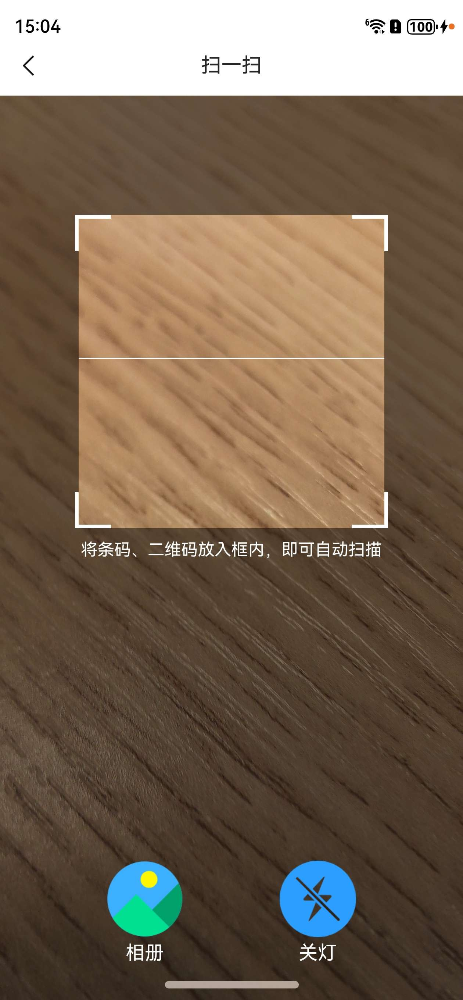

## 鸿蒙扫一扫组件

***

- 利用鸿蒙系统customScan能力
- 支持选择图库扫码能力
- 支持开启关闭闪光灯
- 支持UI定制



使用示例<br>

- 导入

```typescript
import { Scanner, ScannerController } from '@coner/Scanner';
```

- 使用

```typescript
Scanner()
```

## 安装使用

***

```json
ohpm i @coner/scanner
```

## Scanner 属性

***

| 字段名              | 类型                | 默认值                                 | 说明           |
|------------------|-------------------|-------------------------------------|--------------|
| albumsShow       | boolean           | true                                | 相册是否显示       |
| albumsIcon       | ResourceStr       | $r('app.media.scanner_albums')      | 相册图标         |
| albumsIconSize   | Length            | 64                                  | 相册图标大小       |
| albumsText       | string            | '相册'                                | 相册文案         |
| albumsTextSize   | Length            | 16                                  | 相册文案文字大小     |
| albumsTextColor  | ResourceColor     | Color.White                         | 相册文案颜色       |
| lightShow        | boolean           | true                                | 手电筒是否显示      |
| lightCloseIcon   | ResourceStr       | $r('app.media.scanner_light_close') | 手电筒关闭图标      |
| lightOpenIcon    | ResourceStr       | $r('app.media.scanner_light_open')  | 手电筒开启图标      |
| lightIconSize    | Length            | 64                                  | 手电筒图标大小      |
| lightOpenText    | string            | '开灯'                                | 手电筒开启文案      |
| lightCloseText   | string            | '关灯'                                | 手电筒关闭文案      |
| lightTextSize    | Length            | 16                                  | 手电筒文字大小      |
| lightTextColor   | ResourceColor     | Color.White                         | 手电筒文案颜色      |
| tipsShow         | boolean           | true                                | 提示词是否显示      |
| tips             | string            | '将条码、二维码放入框内，即可自动扫描'                | 提示词内容        |
| tipsTextColor    | ResourceColor     | Color.White                         | 提示词文字颜色      |
| tipsTextSize     | Length            | 14                                  | 提示词文字大小      |
| tipsTopMargin    | Length            | 10                                  | 提示词距离上面的间距   |
| maskColor        | ResourceColor     | '#7f000000'                         | 遮罩颜色         |
| scannerSize      | number            | 256                                 | 扫描框宽高        |
| cornerLineWidth  | number            | 3                                   | 角上的框宽度       |
| cornerLineLength | number            | 30                                  | 角上的框长度       |
| cornerLineColor  | ResourceColor     | Color.White                         | 角上的框颜色       |
| scanTopMargin    | number            | 100                                 | 扫描框距离上面的间距   |
| scanLineWidth    | Length            | 1                                   | 扫描线宽度        |
| scanLineLength   | Length            | '100%'                              | 扫描线长度        |
| scanLineColor    | ResourceColor     | Color.White                         | 扫描线颜色        |
| scanLineShow     | boolean           | true                                | 扫描线是否显示      |
| scanAnimTime     | number            | 1500                                | 动画时间         |
| scanIntervalTime | number            | 1000                                | 扫码间隔时间       |
| disableCheckArea | boolean           | false                               | 是否禁止检查二维码在框中 |
| areaOffset       | number            | 100                                 | 二维码在框中的偏移量   |
| controller       | ScannerController | this.scannerController              | 扫码控制类        |

## ScannerController 方法

| 方法             | 入参           | 返回值     | 说明         |
|----------------|--------------|---------|------------|
| openLight      | void         | void    | 打开闪光灯      |
| closeLight     | void         | void    | 关闭闪光灯      |
| toggleLight    | void         | void    | 闪光点开关      |
| pickPhoto      | void         | void    | 选择图片识别二维码  |
| setZoom        | zoom: number | void    | 设置扫码镜头放大比例 |
| getZoom        | void         | number  | 获取扫码镜头放大比例 |
| getLightStatus | void         | boolean | 获取闪光灯开启状态  |
| releaseScan    | void         | void    | 释放相机资源     |
| startScan      | void         | void    | 启动扫码       |
| rescan         | void         | void    | 重启相机扫码     |